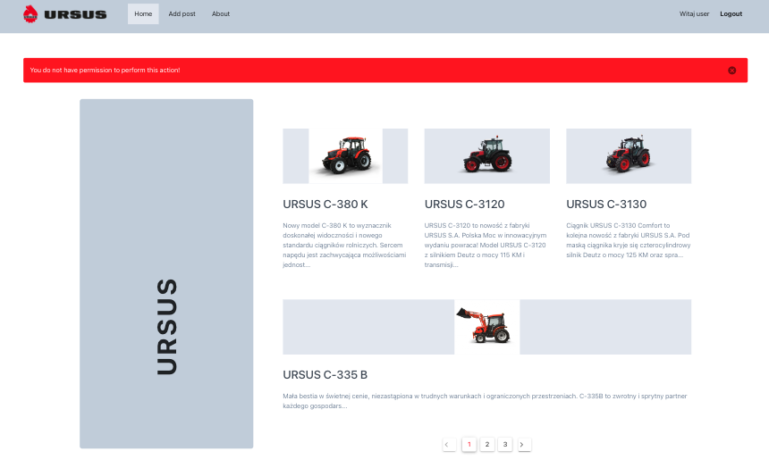

# URSUS


**Ursus** Full Stack App with a login and register option created only for learning purposes and of course for fun. All pictures and information I copied from the original URSUS website link below.

[https://www.ursus.com/pl](https://www.ursus.com/pl)


### Features

- responsiwe web design
- login and register option
- three roles with different access: admin, editor, user
- JSON Web Token for auhentication
- use localStorage for keeping data after reloading page
- each form has full validation
- handle errors


### Under the hood

Technologies being used under the hood:

#### Stack:

- Vue
- Node
- Express
- MongoDB


#### Back-End:

- Node
- Express
- Mongoose
- MongoDB
- Multer
- JsonWebToken

#### Front-End:

- Vue
- VueRouter
- Vuex
- Axios
- Bootstrap
- Vuetify
- LocalStorage




#### Login access:

- admin

  - email: admin@gmail.com
  - password: 123456

- editor

  - email: editor@gmail.com
  - password: 123456

  

## Project setup

```
npm install
```

### Compiles and hot-reloads for development

```
npm run serve
```

### Compiles and minifies for production

```
npm run build
```

### Customize configuration

See [Configuration Reference](https://cli.vuejs.org/config/).


### More info [https://ursusapp.herokuapp.com/about](https://ursusapp.herokuapp.com/about)


### Live view

just visit [https://ursusapp.herokuapp.com/](https://ursusapp.herokuapp.com/)!

Made with [@gregsypek](https://twitter.com/@gregsypek) 2022
